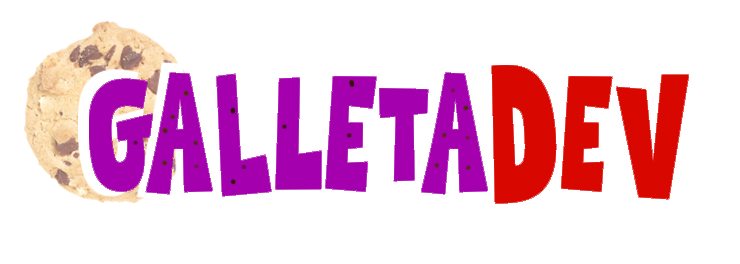

  
  

## Hola soy **GalletaDev** o como **CookieDev**
Soy un desarrollador que se dedica a programar videojuego y sistema de automatizacion mediante Python,
Se tambien dibujar con Krita herramienta de dibujo y diseño con tableta grafica y musica electronica.

# Pero mi enfoque principal ante todo es la *programacion*.

Dev: Little Secrets, Party and Cupcacke, Yukine Ice cream

## Rama principal de aprendizaje

### Habilidades familiares

### 🚀 Actualmente aprendiendo

